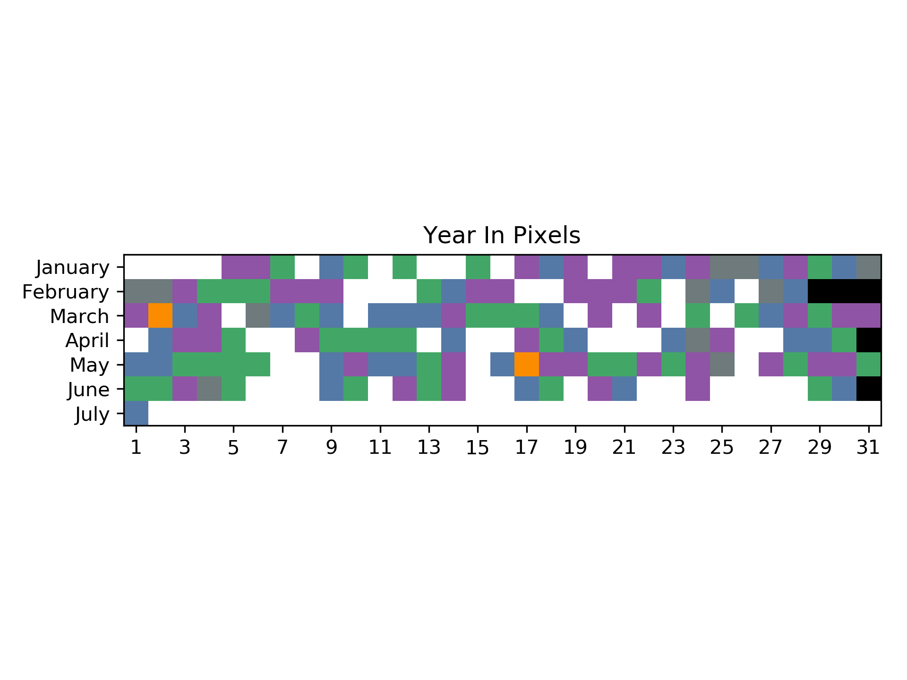

# daylio visualisation

This repository contains a collection of scritps that I wrote to visualize the data from [my mood tracker daylio](https://daylio.webflow.io/).

All code is written in python3.

## Installation

### Python dependencies

```
pip install -r requirements.txt
```

### Getting the data

Currently the scripts assume that you have an `entries.db` in the current working directory. You can get this file from a rooted phone with

```
adb shell 'su -c "cat /data/data/net.daylio/databases/entries.db"' > entries.db
```

To run the scripts without actual data, run them with the `--random-data` option.

## Visualisations

### Year in pixels

The first visualisation is using matplotlib to generate grid with one row for each month and one pixel for each day.
Black pixels are used if the month has less than 31 days.
White pixels are days on which no mood was tracked.
For all other pixels the colorscheme from daylio is used.

To calculate your year in pixels, run

```
python3 year_in_pixels.py
```

The output image is saved into `year_in_pixels.png`.



### Average calculation

Daylio uses a simple average of all mood values during one day to calculate the mood value of the day.
I find this to be too simple, as it disproportianly counts time in which I often track my mood.
These scripts use a different method that is based on the [trapezoidal rule](https://en.wikipedia.org/wiki/Trapezoidal_rule).
The calculation is done on a daily basis, i.e. it does not use the values of other days.


```
python3 average_calculation.py
```
